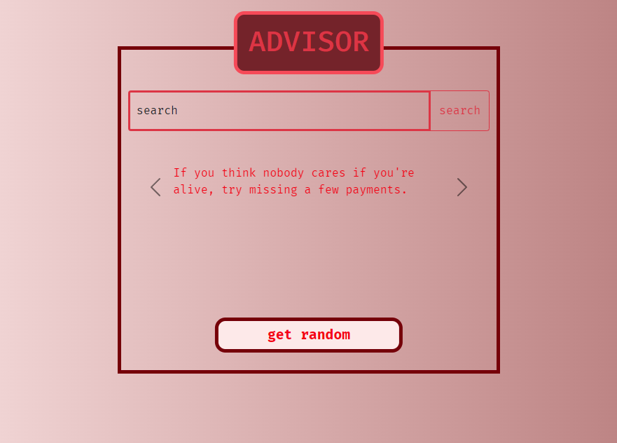

<h1>About</h1>

A web app that displays advice

<h3>Includes</h3>
<ul>
    <li>ability to get a new random advice</li>
    <li>ability to search for advice using simple words</li>
</ul>

<h3>Focus</h3>

To learn how to use web APIs

<h3>Tools</h3>
<ul>
    <li><a href='https://api.adviceslip.com/'>adviceslip web api</a></li>
    <li>codeigniter 3</li>
    <li>php</li>
    <li>bootstrap</li>
    <li>html</li>
    <li>css</li>
    <li>three lines of javascript😁</li>
    <li>visual studio code</li>
</ul>
